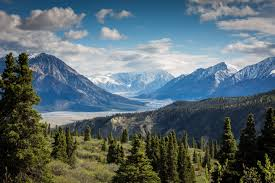
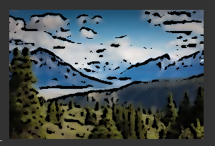

# Introduction

In this project, I used OpenCV and python to make an image look cartooned. 

# Explanation of Code

We first read in the image using the imread function: 

```python
img = cv2.imread("tim.jpg")

```

## Edges

We first convert the input image to grayscale using this line: 

```python
gray = cv2.cvtColor(img, cv2.COLOR_BGR2GRAY)

```

We then apply a median blur on the grayscale image in order to smoothen: 

```python
gray = cv2.medianBlur(gray, 5)

```

 Essentially, the median blur takes the center pixel of a small sub-array of the image array and then takes the median of all the values inside that sub-matrix. This reduces the noise in the image. 

We then apply an adaptive threshold. This algorithm determines the threshold for a pixel based on a small region. Thus, we get different thresholds for different parts of an image, which gives better results for images with poor or varying illumination. 


## Color

We then apply a bilateral filter to the image using the following line of code: 

```python
color = cv2.bilateralFilter(img, 9, 100, 100)

```

This (again) smoothens the images and reduces noise, while also preserving edges. The bilateral filter uses a Gaussian filter. This Gausiaan function makes sure that the only pixels that are far aprt are considered for the filter. You can read more about how exactly the bilateral filter works [here]: https://opencv-python-tutroals.readthedocs.io/en/latest/py_tutorials/py_imgproc/py_filtering/py_filtering.html

## Cartoon 

Finally, we use the bitwise_and function to combine the color and the edges found in the first part of the code.

# Running the code

We are now ready to run the code. The next three lines "print" the cartooned image on the screen. We can see some examples of the cartooning working: 

## Original Image 


## Cartoonized Image


## Original Image 


## Cartoonized Image 



Note: The cartoonization of the image works best on images of size 400 by 400 pixels.  

# Sources

https://docs.opencv.org/master/d7/d4d/tutorial_py_thresholding.html


 


